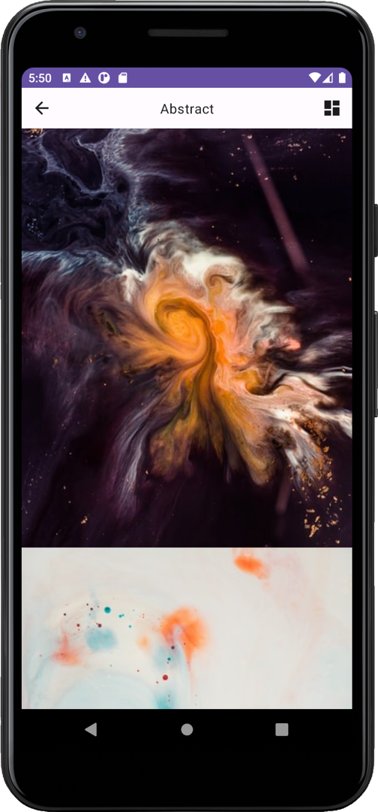

# Image To Desktop
Данное приложение позволяет установить на рабочий стол великолепные картинки из различных категорий.

## Благодарность
Компании Unsplash за предоставления доступа к своему API.

## Tech Stack
Для реализации данного приложения использовались такие технологии как:
* Kotlin:
* Jetpack Compose;
* Kotlin Coroutines;
* Retrofit 2;
* Glide (landscapist);
   
Архитектурное решение: **MVVM**.

## Видео работы
  
## Скрины из приложения
Экран категорий:   
  
Экран с изображениями (списком):  
  
Экран с изображениями (таблицей):  
  

Экран с выбранной картинкой:  
  

Вывод ошибки о неподключенно интернете:  
  
